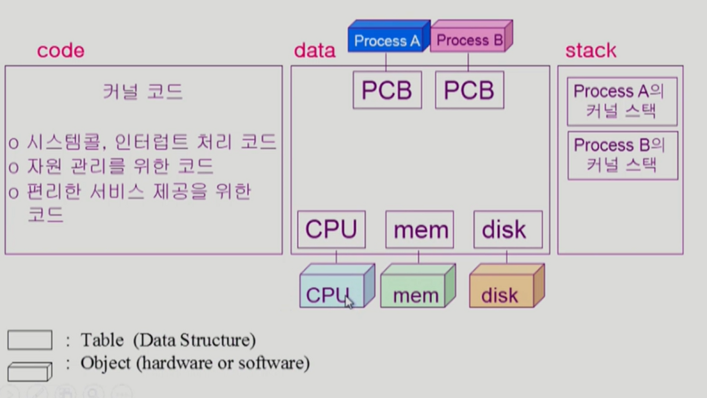

# 1주차 2번째

# 컴퓨터 시스템 구조

- **CPU**는 매 clock cycle 마다 **memory**에서 instruction(기계어)를 읽어 실행한다.
    - I/O는 interrupt를 발생한다.
        - 사용자 프로그램이 timer 시간 동안 제어권을 갖고 있는 상태에서 interrupt가 발생하면 제어권을 I/O에 넘겨주게 된다.
        
- **Mode bit**
    - 사용자 프로그램의 잘못된 수행으로 다른 프로그램 및 운영체제에 피해가 가지 않도록 하기 위한 보호 장치 필요
    - **Mode bit**을 통해 하드웨어적으로 두 가지 모드의 operation 지원
    - **0일 때(운영체제가 CPU에서 실행 중 일때)**
        - 모니터 모드.(커널 모드)
        - 메모리, I/O Device를 접근하는 instruction도 실행 가능하다.
    - **1일 때(사용자 프로그램이 CPU를 가지고 있을 때)**
        - 사용자 모드
        - 제한된 instruction만 CPU에서 사용할 수 있다.
        
- **Timer**
    - Timer
        - 정해진 시간이 흐른 뒤 운영체제에게 제어권이 넘어가지 않도록 인터럽트를 발생시킴
        - 타이머는 매 clock 마다 1씩 감소
            - 타이머 값이 0이 되면 타이머 인터럽트 발생
        - CPU 독점을 방지한다
    - **time sharing을 구현하기 위함**
    - 현재 시간을 계산하기 위해서 사용
    
- **Device Controller**
    - 해당 **I/O** 장치유형을 관리하는 일종의 작은 CPU
    - 제어 정보를 위해 **control register, status registe**r를 가진다.
    - **local buffer**를 가짐
    - I/O는 실제 device와 local buffer 사이에서 발생
    - 
- **Device driver**
    - software
    
- **Interrupt**
    - 인터럽트 당한 시점의 레지스터와 **program counter를 save한 후 CPU의 제어를 인터럽트 처리 루틴에 넘긴다**
    - 
- **Interrupt 관련 용어**
    - **인터럽트 벡터**
        - 해당 인터럽트의 처리 루틴 주소를 가지고 있음
    - **인터럽트 처리 루틴**
        - 해당 인터럽트를 처리하는 커널 함수(=interrupt Service Routine, 인터럽트 핸들러)
        
- **시스템콜(System Call)**
    - 사용자 프로그램이 운영체제의 서비스를 받기 위해 커널 함수를 호출하는 것

- 컴퓨터 시스템 구조
    - CPU
        - 아주 빠른 일꾼이라고 할 수 있다.
        
- **동기식 입출력과 비동기식 입출력**
    - **동기식 입출력**
        - I/O 요청 후 입출력 작업이 완료된 후에야 제어가 사용자 프로그램에 넘어감
        - 구현 방법 1
            - I/O가 끝날 때까지 CPU를 낭비
            - 매시점 하나의 I/O만 일어날 수 있다.
        - 구현 방법 2
            - I/O가 완료될 때까지 해당 프로그램에게서 CPU를 빼앗음
            - I/O 처리를 기다리는 줄에 그 프로그램을 줄 세움
            - 다른 프로그램에게 CPU를 줌
    - **비동기식 입출력**
        - I/O가 시작된 후 입출력 작업이 끝나기를 기다리지 않고 제어가 사용자 프로그램에 즉시 넘어감
    - 두 경우 모두 I/O의 완료는 인터럽트로 알려준다.
- **DMA(Direct Memory Access)**
    - 빠른 입출력 장치를 메모리에 가까운 속도로 처리하기 위함
    - CPU의 중재 없이 device controller가 device의 buffer storage의 내용을 메모리에 block단위로 직접 전송.
    - 바이트 단위가 아니라 block 단위로 인터럽트를 발생한다.
- **서로 다른 입출력 명령어**
    1. **Special instruction**
    2. **Memory Mapped I/O**
    
- **저장장치**
    - Speed
    - Cost
    - **Volatility(휘발성)**
        - 휘발성
            - 레지스터, 캐시메모리, 메인메모리
            - caching
                - 재사용을 목적으로 함.
        - 비휘발성
            - 하드디스크, Magnetic Tape
- 프로그램 실행
    - 가상 메모리를 사용
- 커널 주소 공간의 내용
    
    
    
    - PCB
        - **Process control block**
            - 프로세스 마다 생성되어 관리하는데 사용된다.
- 사용자 프로그램이 사용하는 함수
    - 함수(function)
        - 프로세스의 Address Space
            - 사용자 정의 함수
                - 자신의 프로그램에서 정의
            - 라이브러리 함수
                - 자신의 프로그램에서 정의하지 않은 함수.
        - Kernel의 Address Space
            - 커널 함수
                - 운영체제 프로그램의 함수
                - 커널 함수의 호출 == 시스템 콜